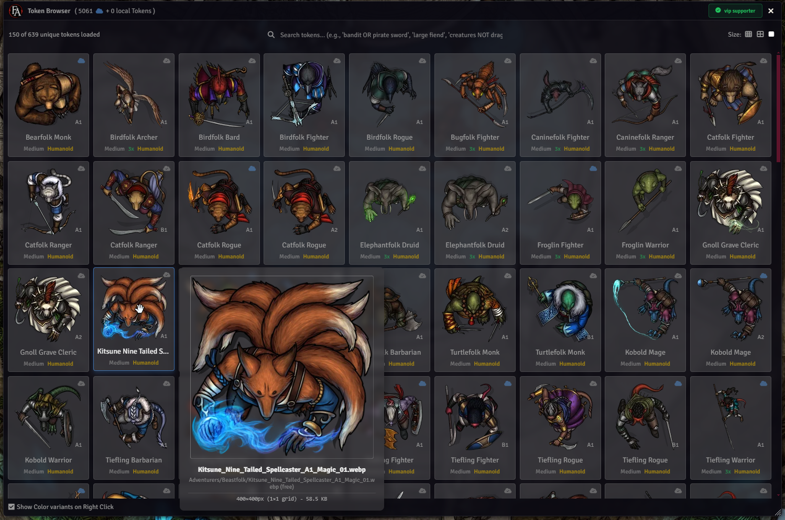
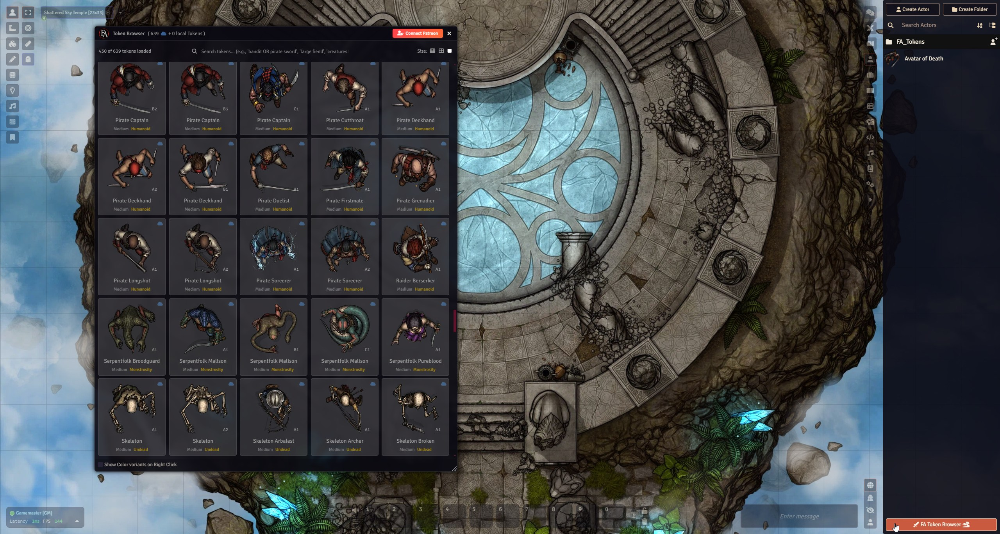
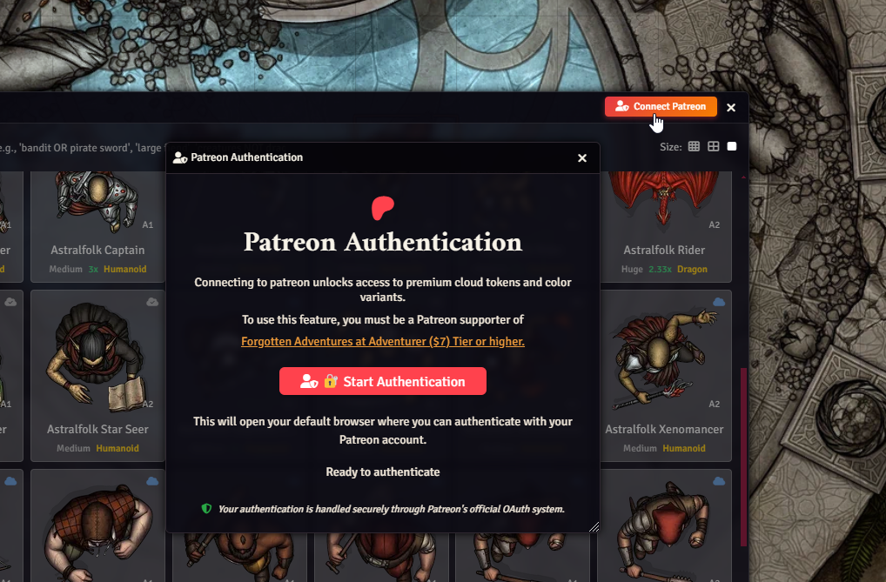

# FA Token Browser

A specialized token browser for Foundry VTT designed specifically for Forgotten Adventures tokens. Built around FA's token collection and cloud service, this module provides an easy and efficient way to browse, search, and use FA tokens directly in your Foundry VTT games.




## Features

### ⭕ **Core Functionality**
- **Unified Token Browser**: Browse both local and cloud tokens in a single interface
- **Advanced Search**: Powerful search engine with filtering capabilities
- **Drag & Drop**: Seamless token placement directly onto actors and scenes
- **Color Variants**: Browse and select from multiple color variants for each token
- **Wildcard Tokens**: Download all color variants as wildcards for randomized token appearances
- **Thumbnail Sizes**: Adjustable thumbnail sizes (small, medium, large) for optimal viewing

### ☁️ **Cloud Integration**
- **Free Tokens**: Immediate access to our complete gallery of our Free tokens with no additonal setup
- **Patreon Authentication**: Secure OAuth integration for premium token access (and color variants)
- **Premium Token Access**: Unlock exclusive tokens with Patreon Adventurer tier ($7+) or higher
- **Smart Caching**: Intelligent caching system for improved performance
- **ForgeVTT Optimized**: Special optimizations for ForgeVTT environments (WIP)

## Installation

### Method 1: Install URL (Recommended)
1. Open Foundry VTT and navigate to **Add-on Modules**
2. Click **Install Module**
3. Enter the following URL:
   ```
   https://raw.githubusercontent.com/Forgotten-Adventures/FA-Token-Browser/main/module.json
   ```
4. Click **Install**

### Method 2: Manual Installation
1. Download the [latest zip](https://github.com/Forgotten-Adventures/FA-Token-Browser/raw/main/fa-token-browser.zip)
2. Extract the ZIP file to your Foundry VTT `modules` folder
3. Restart Foundry VTT
4. Enable the module in your world settings

## Usage

### Getting Started
1. **Enable the Module**: Go to your world settings and enable "FA Token Browser"
2. **Access the Browser**: Use the "FA Token Browser" at the bottom of "Actors" panel
3. **Browse Tokens**: Use the search bar to find specific tokens or simply scroll!



### Cloud Token Access
1. **Connect Patreon**: Click the Patreon connect button in the token browser
2. **Authenticate**: Complete the OAuth process in your browser
3. **Access Premium Content**: Once authenticated, premium tokens will be available
4. **Requirements**: Must be a Patreon supporter at Adventurer tier ($7) or higher



### Token Management
- **Search Filters**: Use the search bar to filter by name, type, or other criteria, supports AND OR NOT terms
- **Preview**: Hover over any token to see a larger preview with detailed info as well as correct size/scale grid representation.
- **Thumbnail Size**: Adjust the thumbnail size using the size selector

https://github.com/user-attachments/assets/1b53dbe4-2636-430a-9363-9e21fbe635b6
  
- **Drag & Drop**: Drag tokens directly onto actors (hold shift to skip confirm window) or scenes
- **Color Variants**: Right Click on a token to view available color variants (When color variants available and option selected)
- **Wildcard Tokens**: Enable "Randomize Wildcard Images" in the token dialog to download all color variants as wildcards, allowing Foundry to randomly select from available colors

https://github.com/user-attachments/assets/f527f486-2b9d-4223-acc9-c07d5e24ff86

## Requirements

- **Foundry VTT**: Version 13 or higher
- **Game Systems**: Tested with 5ednd, pf1 and pf2e
- **Internet Connection**: Required for cloud token access and Patreon authentication
- **Patreon Account**: Required for premium token access (Adventurer tier $7+)

## Configuration

### Module Settings
The module includes several configurable options accessible through Foundry VTT's module settings:

- **Custom Token Folder**: Set a local storage folder from which to load tokens
                            - You can technically load any tokens/images but FA Token Browser is expecting a
                              certain filename standard for all it's funcionality. 
- **Actor Creation Folder**: Set name of the folder where new actors (tokens dropped onto a scene) will be created.
- **Large Previews**: Select to increase size of the hover previews (350px instead of 200px default)
- **Token Cache Directory**: Directory where cloud tokens are cached(downloaded) locally on drag&drop or actor update.

### ForgeVTT Users (WIP, limited testing, might be buggy in cases)
Special optimizations are automatically applied for ForgeVTT environments:
- Optimized cloud storage operations
- Enhanced URL handling
- Improved performance for cloud-hosted games

### Support
For additional support:
- Check the [Issues page](https://github.com/Forgotten-Adventures/FA-Token-Browser/issues) for known problems
- Join the [Forgotten Adventures Discord](https://discord.gg/forgottenadventures) for community support

**Made with ❤ by the Forgotten Adventures team** 
